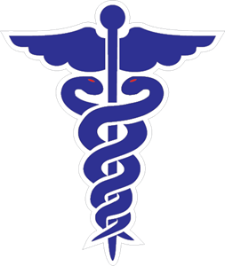

# MWA (Medical Web App)

...

A simple web based Hospital/clinic app that demonstrates how to present data through Django ORM and Restful Django backend.
Builth entirely with **Python**, **HTML**, **CSS** and **JavaScript**.

# How to Run

The program can be started by following these simple steps to setup and configure the project.

- Step 1: Open your Terminal/Console app;
- Step 2: Create a python virtual environment using **Python3.8(preferred)** or/and above;
- Step 3: Activate the virtual environment;
- Step 4: Install project requirements using `pip install -r requirements.txt`;
- Step 5: Apply migrations using `python manage.py migrate`;
- Step 6: Create superuser using `python manage.py createsuperuser`;
- Step 7: Run the development server `python manage.py runserver`;
- Step 8: Open your Web browser;
- Step 9: Navigate to `http://localhost:8000`;

That's all! easy peasy 😄

# Supported platform

1. Linux (verified).
2. Mac.
3. Windows.

# Hosting

This project is hosted at [MWA-Web](https://bit.ly/34Uc8bD) Heroku.
